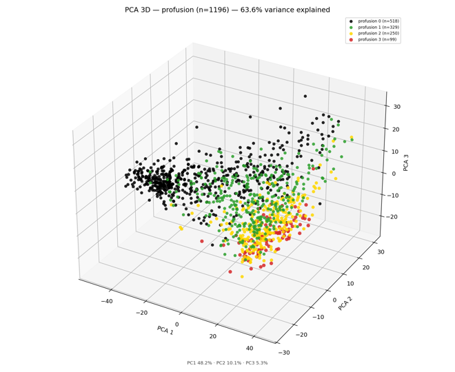
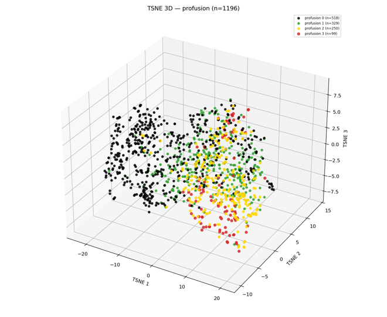
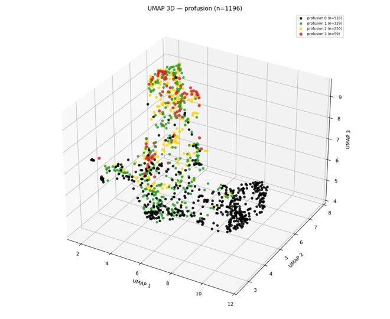
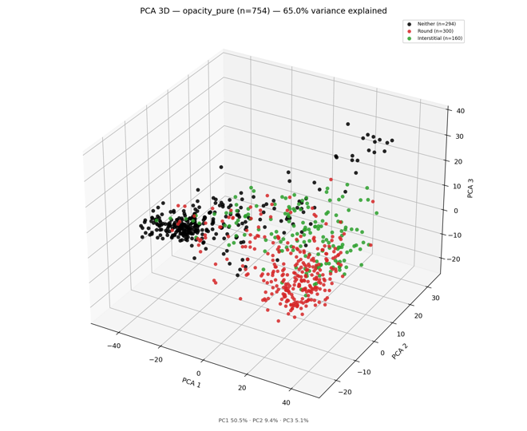
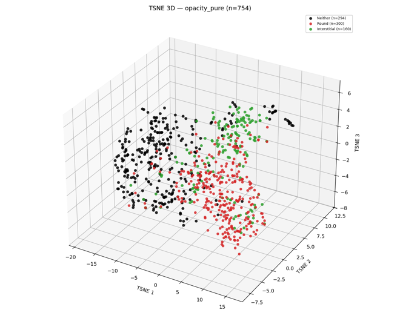
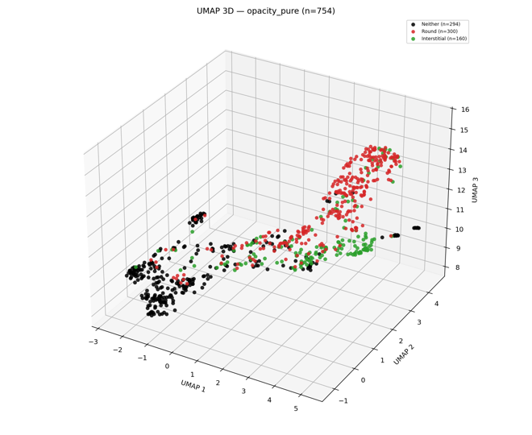

# B-reader model deploy (pull-only)

Self-contained folder to run the **B-reader CXR stack** from pre-built Docker Hub images — no
clone of the full training repo required.

**GitHub:** [github.com/sscotti/breader-model-deploy](https://github.com/sscotti/breader-model-deploy)


| Service                | Image                         | Visibility                       |
| ---------------------- | ----------------------------- | -------------------------------- |
| CXAS preprocess API    | `sdscotti/cxr-preprocess-api` | Public                           |
| Ark inference + Gradio | `sdscotti/breader-inference`  | **Private** (Hub login required) |
| Orthanc + ILO plugin   | `sdscotti/orthanc-breader`    | Public                           |


## What you get (current stack)

- **DICOM or PNG** upload → CXAS anatomy-aware preprocessing → **Ark** embedding
- **Ten classifier heads** (Q2A, Q3A, normal vs not, pleural screen/face/diaphragm, profusion 0–3,
full ILO category, small-opacity type, large-opacity stage)
- **Neighbor retrieval** from training dataset .png images.  Default **Ark (1376-D)**; optional Google ELIXR / contrastive spaces in the UI (see [API.md](API.md))
- **Orthanc** ILO plugin → multi-page PDF report attached to the study

Simplified ILO B-reader Gradio UI

Although the GitHub repo is public, you will need a  DOCKER_HUB_TOKEN from the developer to pull the inference image from Docker Hub.

Models, neighbor PNGs, Ark weights, and bundled heads ship **inside** the inference image.
CXAS UNet weights download on first start (or seed via `cxas/weights/`).

## What ships in this folder

```text
breader-model-deploy/
  docker-compose.yml      # pull + run (no build:)
  .env.sample             # copy → .env
  pull.sh                 # docker login + compose pull
  API.md                  # predict / heads summary for operators
  LICENSE                 # Apache-2.0 (original glue / docs in this folder)
  NOTICE                  # third-party model / data attributions
  TERMS.md                # intended use for the assembled Docker stack
  images/gui.png          # Gradio UI screenshot
  images/projections/     # Ark PCA / t-SNE / UMAP thumbs (profusion + opacity type)
  cxas/weights/           # optional UNet seed (see README there)
  orthanc/
    config/               # orthanc.json, ohif.js
    python/               # ILO PDF plugin (mounted into Orthanc container)
    data/worklists/       # DICOM worklist drop folder
```


## Requirements

- Docker Engine 24+ and Docker Compose v2
- **Docker Desktop → Settings → Resources → Memory: 12 GB+** (inference + CXAS on CPU)
- ~15 GB free disk (images + CXAS weights + Orthanc data)
- **Read access** to private repo `sdscotti/breader-inference` (Hub read token DOCKER_HUB_TOKEN  from maintainer)
- The Docker Hub images are for linux/amd64 arch.  My local dev are for Mac Silicon


## Quick start

```bash
cd breader-model-deploy
cp .env.sample .env
# Edit .env: set DOCKER_HUB_TOKEN (read-only PAT)

./pull.sh
docker compose up -d
```

Open:

- **Inference UI / API:** [http://127.0.0.1:7860/](http://127.0.0.1:7860/)
- **Orthanc:** [http://127.0.0.1:8042/](http://127.0.0.1:8042/)

First CXAS start may take several minutes while UNet weights download (unless seeded).

## Verify

```bash
docker compose ps
curl -sS http://127.0.0.1:8081/health
curl -sS http://127.0.0.1:7860/healthz | jq '{status, embedding_backend, retrieval_kinds}'
curl -sS http://127.0.0.1:8042/system
```

Upload a DICOM in the Gradio UI or see [API.md](API.md) for `curl` examples.

## Inference-only (no Orthanc)

```bash
docker compose up -d cxas-api inference
```


## Orthanc ILO PDF button

The Python plugin under `orthanc/python/` calls `ILO_PREDICT_BASE_URL` (default
`http://inference:7860` on the compose network). In Orthanc Explorer2, expand a study →
instance list → **ILO Inference** button.

Optional plugin defaults: `orthanc/python/ilo_plugin.json` (env vars override at runtime).

## Pin a release

Set tagged images in `.env`:

```bash
INFER_IMAGE=sdscotti/breader-inference:2026-06-17
CXAS_API_IMAGE=sdscotti/cxr-preprocess-api:2026-06-17
ORTHANC_IMAGE=sdscotti/orthanc-breader:2026-06-17
```

Then `./pull.sh && docker compose up -d --force-recreate`.

## Troubleshooting


| Symptom                                                         | Fix                                                                                                                                                 |
| --------------------------------------------------------------- | --------------------------------------------------------------------------------------------------------------------------------------------------- |
| `pull access denied` on inference                               | `docker login` with read token; confirm access to private repo                                                                                      |
| Gradio **“Connection to the server was lost”** on Run Inference | Usually **OOM** (exit 137). Raise Docker Desktop memory to **12 GB+**; keep retrieval on **Ark**; `docker compose up -d --force-recreate inference` |
| Inference restarts in a loop                                    | `docker compose logs inference --tail 50`; check OOM in `docker events`                                                                             |
| Inference starts before CXAS ready                              | Wait for `cxas-api` healthy; restart inference                                                                                                      |
| CXAS slow first boot                                            | Normal; or add `UNet_ResNet50_default.pth` under `cxas/weights/`                                                                                    |
| Old model after maintainer push                                 | `./pull.sh && docker compose up -d --force-recreate`                                                                                                |
| Port in use                                                     | Change `*_HOST_PORT` in `.env`                                                                                                                      |
| `orthanc-ilo` name already in use                               | `docker rm -f orthanc-ilo` then `docker compose up -d`                                                                                              |


## Upstream resources

This stack builds on the following public models and tools (weights and packaging are separate; see each project’s license / access terms):


| Resource                                                                                                     | Role in this deploy                                                                                                                                                                                        |
| ------------------------------------------------------------------------------------------------------------ | ---------------------------------------------------------------------------------------------------------------------------------------------------------------------------------------------------------- |
| [Ark / Ark+](https://github.com/jlianglab/Ark) (jlianglab)                                                   | Swin-Large CXR foundation encoder used for **1376-D embeddings** and the primary classifier / neighbor space                                                                                               |
| [Google CXR Foundation (ELIXR)](https://huggingface.co/google/cxr-foundation/tree/main)                      | Optional **ELIXR** embedding backends and retrieval spaces in the Gradio UI ([Health AI Developer Foundations](https://developers.google.com/health-ai-developer-foundations) terms apply on Hugging Face) |
| [Chest X-Ray Anatomy Segmentation (CXAS)](https://github.com/ConstantinSeibold/ChestXRayAnatomySegmentation) | Anatomy segmentation used by the **preprocess API** (crop / lung-aware normalization before embed)                                                                                                         |


Ark checkpoint used here: `Ark6_swinLarge768_ep50` (request / download via the Ark project’s published channels). CXAS UNet weights are fetched on first container start or seeded under `cxas/weights/`.

### Training data

Labeled chest radiographs used to train the classifier heads were obtained through the
[NIOSH B Reader Program](https://www.cdc.gov/niosh/chestradiography/php/about/), including images
associated with the NIOSH [Chest Image Repository](https://archive.cdc.gov/www_cdc_gov/niosh/topics/chestradiography/repository.html)
(CIR). NIOSH does not endorse this software; any classification outputs are
research / decision-support only and are not a substitute for a certified B Reader.

## Model performance (OOF)

Expanded cohort out-of-fold comparison: **Google ELIXR vs Ark** (primary production
encoder is Ark). Regenerated **2026-07-11**.

| | |
| --- | --- |
| **Google heads** | `GoogleCXR/model/<task>/` (dev repo) |
| **Ark heads** | `Ark/model/<task>/` (bundled in inference image) |
| **Training cohort** | ~1205 films via `training_sets/expanded_8bit_vindr_enhanced.txt` |
| **Labels** | Consensus under `datasets_png/8bit_robust/labels` + VinDr |

### Summary (primary metric per task)

| Task | Primary metrics | Google | Ark | Δ (Ark − Google) | Edge |
| ---- | --------------- | ------ | --- | ---------------- | ---- |
| q2a_binary | AUROC / F1 | 0.962 / 0.910 | 0.973 / 0.926 | +0.011 / +0.017 | Ark |
| q3a_binary | AUROC / F1 | 0.860 / 0.609 | 0.873 / 0.623 | +0.013 / +0.014 | Ark |
| normal_vs_not | AUROC / F1 | 0.965 / 0.815 | 0.974 / 0.841 | +0.009 / +0.026 | Ark |
| profusion_0-3 | QWK / MAE | 0.855 / 0.282 | 0.887 / 0.229 | +0.032 / −0.053 | Ark |
| profusion_full_category | QWK / Accuracy | 0.897 / 0.452 | 0.921 / 0.481 | +0.024 / +0.028 | Ark |
| small_opacities_multiclass_pure | Macro F1 / Macro AUROC | 0.803 / 0.938 | 0.831 / 0.953 | +0.028 / +0.015 | Ark |
| large_opacity_present | AUROC / F1 | 0.976 / 0.745 | 0.987 / 0.830 | +0.011 / +0.085 | Ark |
| large_opacities | QWK / MAE | 0.744 / 0.111 | 0.813 / 0.086 | +0.069 / −0.025 | Ark |
| pleural_calc_any | AUROC / F1 | 0.874 / 0.339 | 0.899 / 0.355 | +0.025 / +0.016 | Ark |
| pleural_calc_face | AUROC / MAP | 0.884 / 0.470 | 0.933 / 0.682 | +0.049 / +0.211 | Ark |
| pleural_calc_diaphragm | AUROC / F1 | 0.883 / 0.157 | 0.889 / 0.123 | +0.006 / −0.034 | Ark |

OOF metrics are the honest generalization estimate for these heads. In-sample / full-cohort
rescored numbers look stronger and are **not** for publication. Not a clinical validation;
an independent labeled set is still needed before claiming deploy-ready performance.

### Sample sizes

| Task | n | Head |
| ---- | - | ---- |
| q2a_binary | 1196 | lr |
| q3a_binary | 1196 | lr |
| normal_vs_not | 1196 | lr |
| profusion_0-3 | 1196 | ordinal_logit |
| profusion_full_category | 1196 | ordinal_logit |
| small_opacities_multiclass_pure | 754 | multinomial_logistic_regression |
| large_opacity_present | 1196 | lr |
| large_opacities | 1196 | ordinal_logit |
| pleural_calc_any | 1196 | pleural_calc_multilabel |
| pleural_calc_face | 1196 | pleural_calc_multilabel |
| pleural_calc_diaphragm | 1196 | pleural_calc_multilabel |

## License

- **Original code** in this folder (compose, Orthanc plugin packaging, scripts, docs):
[Apache License 2.0](LICENSE) — Copyright 2026 Stephen Douglas Scotti.
- **Assembled stack / Docker images** (Ark weights, CXAS, optional Google ELIXR, neighbor
assets): see [NOTICE](NOTICE) and [TERMS.md](TERMS.md). Intended for **research and
education** only; upstream non-commercial and HAI-DEF terms still apply. Not a medical
device and not a substitute for a certified B Reader.


## Maintainers (build + push from dev repo)

From the **full HuggingFaceCXR** repository root (not this folder):

```bash
# 1. Refresh bundled heads + neighbor indices
python inference/scripts/prepare_artifacts.py --profile ark_1376_8bit

# 2. Build all three images
docker compose build

# 3. Tag + push (example)
docker push sdscotti/cxr-preprocess-api:latest
docker push sdscotti/breader-inference:latest
docker push sdscotti/orthanc-breader:latest

# 4. Sync this deploy folder if orthanc plugin or compose changed, then:
cd breader-model-deploy && git add -A && git commit && git push
```

Inference image uses `inference/Dockerfile` (unified Ark + ELIXR embed backends).
Collaborators only need **this** folder + Docker + Hub token.

Zip or share `breader-model-deploy/` with collaborators; they never need the training tree.

## Embedding projections (Ark, expanded cohort)

3-D PCA / t-SNE / UMAP of the **Ark 1376-D** training embeddings, colored by consensus
labels (same expanded cohort as the OOF table above). Small thumbs only; full-res
artifacts live in the training repo under `visualizations/out/ark_alllabels/`.

### Profusion (0–3)

**PCA**



**t-SNE**



**UMAP**



### Small-opacity type (pure)

Same **n = 754** cohort as the deployed `small_opacities_multiclass_pure` head
(Neither / Round / Interstitial; Mixed dropped; Q3A=N; strict-normal neither).

**PCA**



**t-SNE**



**UMAP**


